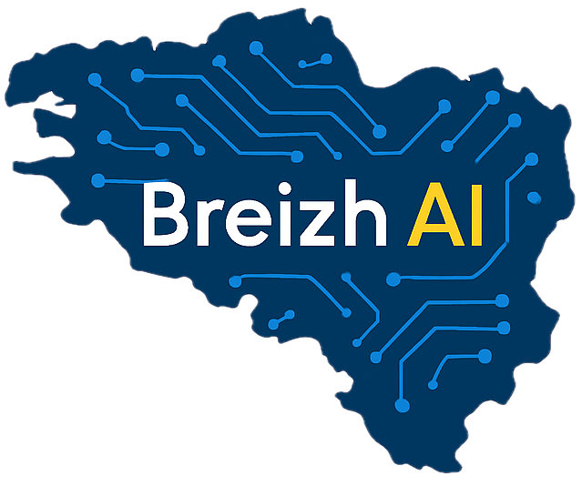

<div align="center">
  
  <h1 align="center">Site Web Vitrine de Breizh AI</h1>
  <p align="center">
    Le référentiel du site web officiel de Breizh AI, conçu pour présenter notre expertise en solutions d'intelligence artificielle sur-mesure.
  </p>
  <p align="center">
    
    
    
    
    
  </p>
</div>

## 🎯 Description Fonctionnelle

Ce site est une application web statique d'une seule page (`Single Page Application`) qui sert de vitrine à **Breizh AI**. Il a pour but de présenter notre mission, nos services, et notre approche pour accompagner les entreprises dans leur transformation par l'intelligence artificielle.

### Nos Services
Le site détaille notre offre en quatre pôles principaux :
1.  **Conseil & Stratégie IA** : Audit, élaboration de feuilles de route et acculturation.
2.  **Réalisations sur-mesure** : Conception et développement d'outils IA adaptés aux besoins métiers.
3.  **Intégration & Déploiement** : Mise en production, interfaçage et maintenance des solutions.
4.  **Analyse de Données & BI** : Valorisation des données, création de dashboards et datavisualisation.

### Public Cible
Nous nous adressons à un large éventail de professionnels :
- **Dirigeants** : Pour un pilotage stratégique de la transformation IA.
- **Ingénieurs** : Pour une collaboration sur des projets techniques avancés.
- **Managers du Digital** : Pour accélérer l'innovation grâce à l'IA.
- **Artisans** : Pour optimiser leur activité avec des outils accessibles.

---

## 🛠️ Architecture Technique

Ce projet est volontairement conçu pour être léger et performant, sans dépendre d'un framework JavaScript lourd ou d'une étape de compilation complexe.

### Frontend
- **Structure** : `HTML5` sémantique.
- **Style** : `Tailwind CSS` utilisé via un lien CDN, complété par une large section de styles CSS personnalisés directement dans le fichier HTML pour des effets avancés (Glassmorphism, animations, etc.).
- **Interactivité** : `JavaScript` vanilla (natif) pour gérer :
    - Le changement de thème (sombre/clair).
    - Le changement de langue (français/anglais).
    - Les animations d'apparition au défilement (`IntersectionObserver`).
    - La gestion du menu mobile.
- **Visuels Avancés** :
    - **`particles.js`** : Pour l'arrière-plan animé de particules.
    - **`@splinetool/runtime`** : Pour l'intégration d'une scène 3D interactive dans la section d'accueil.

### Backend & Automatisation
Le site ne dispose pas d'un backend traditionnel. Cependant, il intègre un processus d'automatisation via un webhook :
- Le formulaire **"Obtenez votre stratégie de croissance"** collecte des informations sur l'entreprise de l'utilisateur.
- Ces données sont envoyées via une requête `fetch` à un webhook **n8n** (`https://n8n.breizh.ai/...`).
- Ce webhook déclenche un workflow d'automatisation qui génère un document de stratégie personnalisé et l'envoie à l'adresse e-mail fournie par l'utilisateur.

---

## 🤖 Description de l'Algorithme

L'unique "algorithme" présent sur ce site est le workflow initié par l'outil de génération de stratégie. Il ne s'agit pas d'un calcul effectué côté client, mais d'un processus de collecte de données et d'automatisation externe.

1.  **Collecte** : L'utilisateur remplit un formulaire détaillé avec des informations sur son entreprise (secteur, taille, chiffre d'affaires, maturité digitale, etc.).
2.  **Transmission** : À la soumission, le JavaScript côté client valide les entrées et envoie les données sous forme d'objet JSON à un point d'entrée sécurisé (webhook n8n).
3.  **Traitement (côté n8n)** : Le workflow n8n reçoit les données. Il est probable qu'il les utilise comme contexte pour interroger un modèle de langage (LLM) comme GPT-4 afin de générer une analyse et des recommandations stratégiques.
4.  **Distribution** : Le résultat est formaté (probablement en PDF) et envoyé automatiquement par e-mail à l'utilisateur.

Ce système permet d'offrir un service à forte valeur ajoutée de manière entièrement automatisée, démontrant ainsi l'expertise de Breizh AI.

---

## 🚀 Démarrage et Développement Local

Aucune installation complexe n'est requise pour travailler sur ce projet.

### Prérequis
- Un navigateur web moderne.
- Python 3 (recommandé pour lancer un serveur local simple).

### Lancement
1.  Clonez ce dépôt :
    ```bash
    git clone https://github.com/votre-utilisateur/votre-repo.git
    cd votre-repo
    ```

2.  Lancez un serveur web local. La méthode la plus simple est d'utiliser le module `http.server` de Python :
    ```bash
    python3 -m http.server
    ```
    Si vous n'avez pas Python, vous pouvez utiliser l'extension **Live Server** de Visual Studio Code.

3.  Ouvrez votre navigateur et accédez à `http://localhost:8000`.

> **Note** : Vous pouvez ouvrir directement le fichier `index.html` dans votre navigateur, mais l'utilisation d'un serveur local est recommandée pour éviter tout problème de sécurité (CORS) lié au chargement de certains scripts ou ressources.

---

## 📁 Structure des Fichiers

Le projet est organisé de manière simple et intuitive :

```
.
├── index.html              # Fichier principal contenant toute la structure, le style et les scripts.
├── README.md               # Ce fichier de documentation.
├── logo-breizh-ai.png      # Logo principal utilisé dans le site et ce README.
├── favicon.png             # Icône du site pour les onglets du navigateur.
├── *.jpg, *.png, *.svg     # Toutes les autres images et icônes utilisées sur la page.
├── *.mp4                   # Fichiers vidéo (si applicable).
└── ...                     # D'autres fichiers HTML peuvent être des sauvegardes ou des tests.
```

---

## 📞 Contact

Pour toute question, suggestion ou opportunité de collaboration, n'hésitez pas à nous contacter à **contact@breizh.ai**.

<div align="center">
  &copy; 2025 Breizh AI. Conçu en Bretagne, France.
</div>
